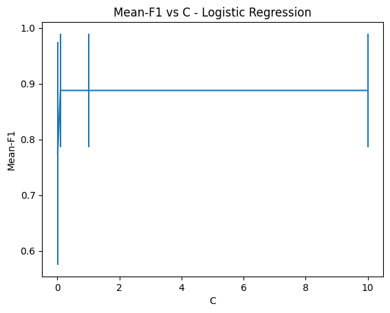
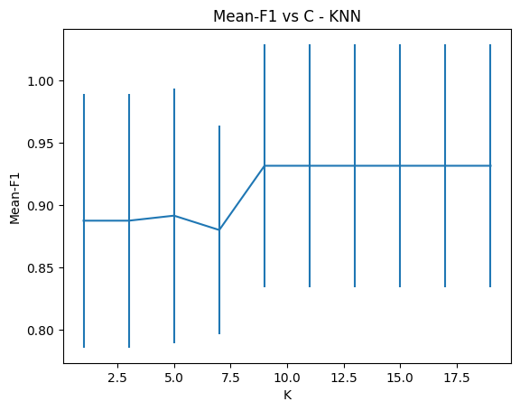
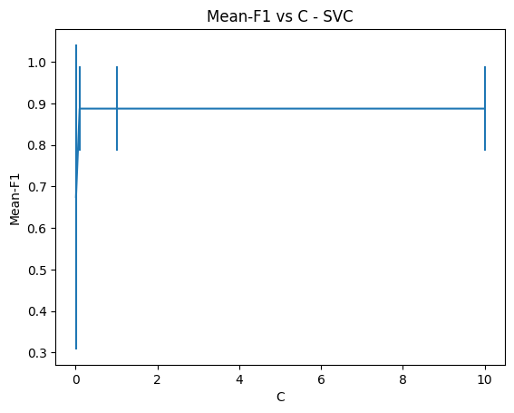
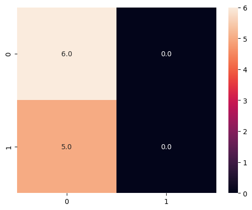
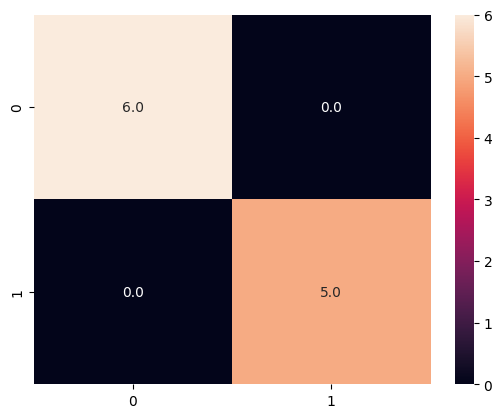
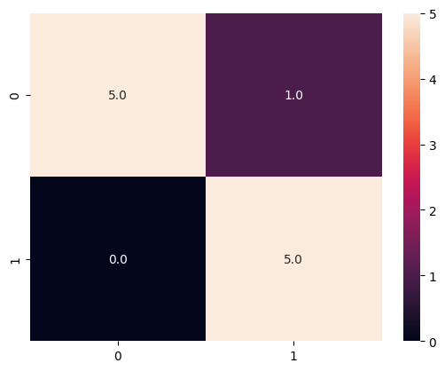
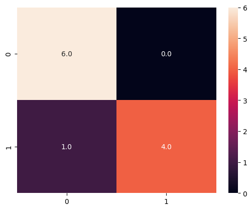
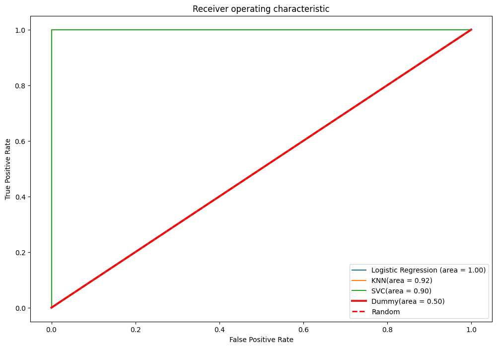

# **Week 5 - Assignment**

## Vulnerability Detection in a Solidity Smart Contract

**Participants: Rudra, Varun, Vatsal**

---

## Introduction

Our motivation for this project is to detect vulnerabilities in a smart contract written in solidity. In ethereum, Solidity Smart contracts play an important role for the exchange of etherium coin and NFTs. These goods are worth a lot of money and it becomes an easy target to send malacious code via a smart contract to steal wallet balance, NFTs, etc. Hence, it is important to detect vulnerabilities in a smart contract before it is deployed on the ethereum blockchain.

For this project we used the [SmartBugs]("https://github.com/smartbugs/smartbugs/tree/a7c1f1a41d780313685c57bcc488916b14b1f302/dataset") and [SolidiFi Benchmark]("https://github.com/DependableSystemsLab/SolidiFI-benchmark/tree/master/buggy_contracts/Re-entrancy") dataset. This dataset contains 1000 smart contracts written in solidity. Each smart contract is annotated with the vulnerabilities it contains. The dataset is split into 3 parts: train, validation and test. We used the train and validation set for training and testing our model. The test set was used for final evaluation of our model. The are multiple vulnerabilities that are present in a Solidity smart contract.
Vulnerabilities considered for this dataset are:

- Saving unencrypted confidential data on the blockchain
- Integer overflow and underflow (solved since solidity 0.8)
- Unchecked call return values
- Re-entrancy attacks
- Denial Of Service attacks
- Front Running attacks
- Replay signatures attacks
- Function default visibility

Among these vulnerabilities, we found that re-entrancy attacks are the most common type of attack that introduces a foreign function call in a smart contract that can invoke a RPC (Remote Procedural Call), which can introduce a foreign code execution, thus stealing the funds from a wallet.

In our project, we used the methods of **static analysis** and **NLP** to detect vulnerabilities in a smart contract. We converted the solidity code into a sequence of tokens and then used the sequence to train a model. The model was trained using the train and validation set. The model was then tested on the test set. We converted the tokens into a series of vectors and then trained multiple models on the vectors.

The following models were used for training:

- Logistic Regression
- KNN Classifier
- SVM Classifier

The output of the model was a probability of the smart contract containing a particular vulnerability. The vulnerability with the highest probability was considered as the vulnerability of the smart contract. This model now can be used as a pre-test for any smart contract before it is deployed on the ethereum blockchain.

## Dataset

The dataset for this project are [SmartBugs](https://github.com/smartbugs/smartbugs/tree/a7c1f1a41d780313685c57bcc488916b14b1f302/dataset) and [SolidiFi Benchmark](https://github.com/DependableSystemsLab/SolidiFI-benchmark/tree/master/buggy_contracts/Re-entrancy). We will only be considering the **Re-entrancy** vulnerability.

The Smartbugs data contains a `vulnerabilities.json`. This `json` file contains the labels and line number for all the vulnerabilities and looks as such:

```json
{
        "name": "FibonacciBalance.sol",
        "path": "dataset/access_control/FibonacciBalance.sol",
        "source": "https://github.com/sigp/solidity-security-blog",
        "vulnerabilities": [
            {
                "lines": [
                    31
                ],
                "category": "access_control"
            },
            {
                "lines": [
                    38
                ],
                "category": "access_control"
            }
        ]
    },
```

We start to preprocess this data by filtering out all the files containing a **re-entrancy** vulnerability. We then traverse over the remaining dataset matching the filenames as keys and then matching line numbers as values that correspond to code in that given file and then in third column give the vulnerability name as originally the file may contain other vulnerabilities too.

> Note: Preprocessing also removes all the comments and spaces from the code.

The preprocessed data looks like this:

|     | filename                                       | code                                       | category         |
| --- | ---------------------------------------------- | ------------------------------------------ | ---------------- |
| 0   | 0xb93430ce38ac4a6bb47fb1fc085ea669353fd89e.sol |                                            | No Vulnerability |
| 1   | 0xb93430ce38ac4a6bb47fb1fc085ea669353fd89e.sol | pragma solidity ^0.4.19;                   | No Vulnerability |
| 2   | 0xb93430ce38ac4a6bb47fb1fc085ea669353fd89e.sol | contract PrivateBank                       | No Vulnerability |
| 3   | 0xb93430ce38ac4a6bb47fb1fc085ea669353fd89e.sol | {                                          | No Vulnerability |
| 4   | 0xb93430ce38ac4a6bb47fb1fc085ea669353fd89e.sol | mapping (address => uint) public balances; | No Vulnerability |

This data is then converted into a sequence of tokens. The tokens are then converted into vectors and then fed into the model for training.

For vectorization, we used the `tfidf` vectorizer with `n-gram 2`. The `n-gram 2` creates a _bi-gram_ data of the code which means that it creates a pair of tokens sequentially. For example, if the code is `pragma solidity ^0.4.19;`, then the `n-gram 2` will create the following pairs:

> `pragma solidity`

```python
tfidf_vectorizer_vectors[1:5]
```

> matrix([[0. , 0. , 0. , 0. , 0. ,

       1.        , 0.        , 0.        , 0.        , 0.        ,
       2.        , 0.        , 0.        , 0.        , 0.        ,
       3.        , 0.        , 0.        , 0.        , 0.        ,
       4.        , 0.28867513, 0.        , 0.28867513, 0.        ,
       5.        , 0.        , 0.        , 0.        , 0.        ,
       6.        , 0.        , 0.        , 0.        , 0.28867513,
       7.        , 0.        , 0.        , 0.        , 0.        ,
       8.        , 0.        , 0.        , 0.        , 0.        ,
       9.        , 0.28867513, 0.28867513, 0.        , 0.        ,
       10.       , 0.        , 0.        , 0.        , 0.        ,
       0.28867513, 0.        , 0.        , 0.        , 0.        ,
       11.       , 0.28867513, 0.        , 0.        , 0.        ,
       12.       , 0.        , 0.        , 0.        , 0.        ,
       13.       , 0.28867513, 0.        , 0.        , 0.        ,
       14.       , 0.        , 0.        , 0.        , 0.        ,
       15.       , 0.        , 0.28867513, 0.        , 0.        ,
       16.       , 0.        , 0.28867513, 0.28867513, 0.28867513,
       17.       , 0.        , 0.        , 0.        , 0.        ,
       18.       , 0.        , 0.        , 0.        , 0.        ,
       19.       , 0.        , 0.        , 0.        , 0.        ,
       20.       , 0.        , 0.        , 0.        , 0.        ],
      [0.        , 0.        , 0.        , 0.        , 0.        ,
       21.       , 0.4599092 , 0.        , 0.        , 0.        ,
       22.       , 0.        , 0.        , 0.        , 0.        ,

... 0. , 0. , 0. , 0. , 0. , 0. , 0. , 0. , 0. , 0. , 0. , 0. , 0. , 0. , 0. , 0. , 0. , 0. , 0. , 0. , 0. , 0. , 0. , 0. , 0.]])

## Methodology and Implementation

The model was implemented using the `sklearn` library in python. The model was trained on the `tfidf` vectorized data. The model was trained on the following models:

1. Logistic Regression
2. K-Nearest Neighbors
3. Support Vector Machine

All of these models, capture the best for capturing the diverse decision boundaries of the data and as our data has a lot of sparcity, these models tend to perform better in such cases.

### Logistic Regression

Logistic regression is a classification algorithm used to assign observations to a discrete set of classes. It is a probabilistic classifier, which means that it outputs a probability that an observation belongs to each of the classes. The probability is calculated using the logistic function.

The logistic regression model was trained on the following parameters:

- `C`, which is the inverse of regularization strength is used to control the overfitting. Smaller values specify stronger regularization.

### K-Nearest Neighbors

K-Nearest Neighbors is a non-parametric method used for classification and regression. In both cases, the input consists of the k closest training examples in the feature space. The output depends on whether k-NN is used for classification or regression. In k-NN classification, the output is a class membership. An object is classified by a majority vote of its neighbors.

The K-Nearest Neighbors model was trained on the following parameters:

- `K`, which is the number of neighbors to use.

### Support Vector Machine

Support Vector Machine is a supervised machine learning algorithm which can be used for both classification or regression challenges. However, it is mostly used in classification problems. In this algorithm, each data item is plotted as a point in n-dimensional space (where n is number of features you have) with the value of each feature being the value of a particular coordinate. Then, we perform classification by finding the hyper-plane that differentiate the two classes very well.

The support vector machine model was trained on the following parameters:

- `C`, which is the inverse of regularization strength is used to control the overfitting. Smaller values specify stronger regularization.

## Experimental Results

Our experiments were conducted on the following metrics:

The Train size after downsampling is 41 samples
The Test size after downsampling is 11 samples

> We used the 5-fold crossvalidation to evaluate the performance of the model

### Logistic Regression

The values of `C` used for cross-validation were `0.01`,`0.1`, `1`, `10`.

The best value of `C` was `0.1` with an f1-score of `0.88`.



The values of `C` above `1` had an _overfitting_ effect on the prediction of the model and we faced a problem of imbalance in the data initially. Therefore, an undersampling was done to balance the data.

> The undersampling was done using the `RandomUnderSampler` from the `imblearn` library. The undersampling was done on the whole dataset.

The above strategy allowed us to control the overfitting and class imbalance.

### K-Nearest Neighbors

The values of `K` used for cross-validation were `1`,`3`, `5`, `7`, `9` ,`11` ,`13` ,`15`,`17`,`19`.

The best value of `K` was `11` with an f1-score of `0.9`.



### Support Vector Machine

The values of `C` used for cross-validation were `0.01`,`0.1`, `1`, `10`.

The best value of `C` was `0.1` with an f1-score of `0.88`.



### Metrics

The metrics used for evaluation were:

- `f1-score`
- `ROC-AUC`
- `Accuracy`

#### f1-score

The f1-score is the weighted average of precision and recall. Therefore, this score takes both false positives and false negatives into account. Intuitively it is not as easy to understand as accuracy, but f1 is usually more useful than accuracy, especially if you have an uneven class distribution. Accuracy works best if false positives and false negatives have similar cost. If the cost of false positives and false negatives are very different, it’s better to look at both precision and recall.

#### ROC-AUC

ROC-AUC is the area under the Receiver Operating Characteristic curve. The ROC curve is a plot of the true positive rate against the false positive rate. AUC represents the degree or measure of separability. It tells how much model is capable of distinguishing between classes. Higher the AUC, better the model is at predicting 0s as 0s and 1s as 1s. By analogy, Higher the AUC, better the model is at distinguishing between patients with disease and no disease.

#### Accuracy

Accuracy is the ratio of number of correct predictions to the total number of input samples. It is the most intuitive performance measure and it is the one we will use most often. However, it does not tell the whole story when it comes to classification problems.

### Performance Analysis

The performance of the models was analyzed using the following metrics:

- Baseline Model



#### Baseline Model Classification Report

|              | precision | recall | f1-score | support |
| ------------ | --------- | ------ | -------- | ------- |
| 0            | 0.55      | 1.00   | 0.71     | 6       |
| 1            | 0.00      | 0.00   | 0.00     | 5       |
| accuracy     |           |        | 0.55     | 11      |
| macro avg    | 0.27      | 0.50   | 0.35     | 11      |
| weighted avg | 0.30      | 0.55   | 0.39     | 11      |

- Logistic Regression



#### Logistic Classification Report

|              | precision | recall | f1-score | support |
| ------------ | --------- | ------ | -------- | ------- |
| 0            | 1.00      | 1.00   | 1.00     | 6       |
| 1            | 1.00      | 1.00   | 1.00     | 5       |
| accuracy     |           |        | 1.00     | 11      |
| macro avg    | 1.00      | 1.00   | 1.00     | 11      |
| weighted avg | 1.00      | 1.00   | 1.00     | 11      |

The logistic regression is overfitting the data. The model is not generalizing well on the test data, as we have obtained accuracy of `1.00` on the test data.

- K-Nearest Neighbors



#### K-Nearest Neighbors Classification Report

|              | precision | recall | f1-score | support |
| ------------ | --------- | ------ | -------- | ------- |
| 0            | 1.00      | 0.83   | 0.91     | 6       |
| 1            | 0.83      | 1.00   | 0.91     | 5       |
| accuracy     |           |        | 0.91     | 11      |
| macro avg    | 0.92      | 0.92   | 0.91     | 11      |
| weighted avg | 0.92      | 0.91   | 0.91     | 11      |

The K-Nearest Neighbors model is performing well on the test data. The model is generalizing well on the test data, as we have obtained accuracy of `0.91` on the test data.

- Support Vector Machine



#### Support Vector Machine Classification Report

|              | precision | recall | f1-score | support |
| ------------ | --------- | ------ | -------- | ------- |
| 0            | 0.86      | 1.00   | 0.92     | 6       |
| 1            | 1.00      | 0.80   | 0.89     | 5       |
| accuracy     |           |        | 0.91     | 11      |
| macro avg    | 0.93      | 0.90   | 0.91     | 11      |
| weighted avg | 0.92      | 0.91   | 0.91     | 11      |

The Support Vector Machine model is performing well on the test data. The model is generalizing well on the test data, as we have obtained accuracy of `0.91` on the test data.

#### Basline Comparison

Baseline had an accuracy of `55%`, and the other models have an average of `90%`. The baseline model is not performing well on the test data. The other models are performing well on the test data.

#### ROC-AUC Curve



This roc curve shows all the models have a good amount of performance, but the K-Nearest Neighbors model has the best performance. The K-Nearest Neighbors model has the highest AUC score of `0.92`. From the discussion above we have seen that logistic regression is overfitting the data.

> The models don't have any false positives prediction as per the observations from the confusion matrix.

## Summary of the work

We started with the Smartbugs dataset which contains different types of vulnerabilities. Initially we wanted to implement what was done in the [**research paper**](hindawi.com/journals/scn/2021/5798033/) but were unsuccessful in doing so. Finally we decided that we will follow a different method. The method we came up with was to tokenise the code text and then apply natual language processing on it. We used KNN, SVM and Logistic regression models along with cross-validation on the dataset. We also plotted RoC curves and Confusion Matrix for the results. The final outcome that we found after doing our analysis was that the KNN and SVM models have the highest f1-score (`0.91`) for the given dataset while the Logistic Regression model that we developed overfit the dataset (f1-score=`1.00`). All this was tested against a basline model (DummyClassifier) which predicts the most frequent class. The basline model has an f1-score of `0.71`. The RoC curve also confirms this. The K-Nearest Neighbors model has the highest AuC score of `0.92`. We also observed from the Confusion Matrices that all of the models developed by us did not have any false positive predictions.

## Roles and Responsibilities

Varun Sharma:

I worked on the data preprocessing part. Initially, we were following a [**research paper**](hindawi.com/journals/scn/2021/5798033/). The methedology the paper followed was clear at first but it became unclear towards the end. I cleared ASTs from the solidity code and wrote 2 algorithms to get the shared child nodes in the AST of the contract ot be analysed and the vulnerable contracts. It was not clear from the paper what the next steps were, therefore another approach which has been discussed above was followed.

For report: I did the Introduction and summary.

Vatsal Tulshyan:

I implemented all the machine learning models for this project. I also did the qualitative and quantitave analysis on the results. I implemented the KNN, SVM and Logistic Regression models. The results were graphically described using the RoC curve and Confusion Matrix. I also did the cross validation for the models.

For report: I did the Methodology, and Results.

Rudra Arora:

I worked on data preprocessing. To preprocess this data by filtering out all the files containing the **re-entrancy** vulnerability. I also worked on the data cleaning part. I removed all the duplicate files from the dataset. I also experimented with Conkas and ASTs, understanding how the iterative version of smart bugs works. I understood that the ASTs are not required for this project as they go into decompilation of the code and then generate the hex signatures which we are not using.

For report: I did the Results and Discussion.
